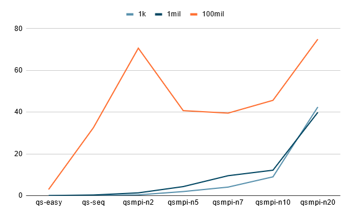

# Quick-select-Assignment

## Homework 2
In this assignment we have to find the k-th value of an unsorted array, when considering the array to be sorted. We will be using MPI to coordinate this search and apply this algorithm to datasets that cannot fit into one machine since when the data can fit into one computational machine the program should always run faster when executed locally.


## Quick select easy
- quick-select-easy.jl

Julia sorts the array and then returns the k-th element by printing the k-th element of the sorted array.

```julia
sorted_A=sort(A)
println("The element number $k of the sorted array is: $(sorted_A[k])")
```


## Quick select sequential
- quick-select-seq.jl

This algorithm revolves around creating a random `pivot` point somewhere inside the array and using it to seperate the array into two parts. The first part of the array contains only elements that are smaller than the pivot point *symblized with 'o'* and the second part contains elements equal or bigger than the pivot point *symblized with '■'*. 


After having two pointers traverse the array, one from the start and one from the end, whenever they each come in contact with an element that should be on the opposite side the swap values and continue doing that until they have met each other. 
<pre>
Both i and j have encountered an element on the wrong side.

      i                         j
      ↓                         ↓
o o o ■ o ■ ■ o o o ■ o o ■ ■ ■ o ■ ■ ■ ■ ■ 

So, they swap

      i                         j
      ↓                         ↓
o o o o o ■ ■ o o o ■ o o ■ ■ ■ ■ ■ ■ ■ ■ ■ 

and continue parsing the array from both sides.
</pre>

In the start of the algorithm the pivot swaps its value with the first element of the array so that it can be stored inside the A[1], out of the way, and when, finally, the partitioning is done we assign the pivot to equal a position relative to i and j, since the two of them overlap, with which we perform a swap between the pivot and the A[1]. The logical proof behind the correct allocation of the pivot position goes as follows:

<pre>
We have these posible ways of arranging i and j depending on if they are on a square that is
bigger '■' or smaller 'o' than the pivot.

   i j      
   ↓ ↓
a. o ■ | Here i meets an element smaller than A[1] so it moves forward ending up in the 
         black square with j.
b. ■ o | Here i is stuck at a black square so now j has to move but it cannot. A swap takes 
         place ending up with posiblitiy number 1.
c. ■ ■ | Here i is stuck so j moves to i's position.
d. o o | Here i moves to j's position
</pre>

<pre>
All in all, the end state is described by:
1| o ■ ← (i,j)  |
2| ? ■ ← (i,j) ■| if '?' exists it is 'o'
3| o o ← (i,j) ?| if '?' exists it is '■'
p.s.: '?' symbolizes an element that we dont know if it exists or not
</pre>

- In case 1 we assign pivot to the element before i,j and swap its value with `A[1]`.
- In case 2 we assign pivot to the element before i,j and if `(i,j)!= 2` then we also swap its value with `A[1]`. 
- In case 3 we assign pivot to (i,j).
- In the extreme cases where the array is smaller than 3 elements in size:
    - If they are 2 then `i==j` so we dont need to change any elements position
    - Having only one element leads to `i>j` so the while loop doesnt run and the `pivot==k`

<pre>
After this procedure the array should always look like:
              pivot
                ↓
o o o o o o o o ■ ■ ■ ■ ■ ■ ■ ■ ■ ■ ■ ■ ■ ■ 
</pre>

Finding the k-th value occurs when our randomly assigned pointer overlaps with the position of the k-th value of the sorted array. The way we are able to tell if this criteria is met is by counting how many elements are bigger than and smaller than our pivot. In other words, the pivot gets assigned its absolute sorted position (meaning: correct position in a sorted array) each time the program sorts the array into those two parts. If pivot==k we are done. 
If we don't get lucky we rise our chances by reducing the array to either the first or the second part depending on if k is bigger than the number of the elements that are less than the pivot. If it is bigger then the search is continues on the second part of the array but if it is smaller it continues on the first part. This way we progressively shorten the part of the array that we work on and rise our chances of the pivot overlapping with k. 

<pre>
Lets say it is bigger than the pivot:

               pivot      (keep this)
                ↓              ↓ 
o o o o o o o o ■ | ■ ■ ■ ■ ■ ■ ■ ■ ■ ■ ■ ■ ■ |

Lets say now it's smaller than the new pivot:

                     (keep this)  new pivot
                          ↓           ↓
                  | o o o o o o o o | ■ ■ ■ ■ ■

Now bigger again:
               new pivot deluxe
                      ↓
                  o o ■ | ■ ■ ■ ■ ■ |

Now bigger again:
                     new pivot deluxe plus
                              ↓
                        o o o ■ | ■ |  

Now bigger again:
                            Value found!
                                  ↓
                                  ■

This has been a quick visual representation of the program's steps.
</pre>

## Quick select mpi
In this algorithm we have to split the whole array into **n** number of sub arrays and scatter them, one sub array to each proccess. Then we will have to tweak the way we determine when we have reached the k-th element. This way involves seperating the subarrays again into two parts, one >= than the pivot and one < than the pivot but here we broadcast a pivot sampled from the whole array that all of the subarrays are going to compare against. Because the pivot might not appear in some sub arrays we dont keep a variable named pivot for each subarray. Instead we set our success condition to be either every subarray element is the same with every other subarray element or only one element remains in the entire array.  
<pre>
Whole Array:
   less(than pivot)      more(than pivot)
o o o o o o o o o o o | ■ ■ ■ ■ ■ ■ ■ ■ ■ |

Sub-Arrays:
o o ■ ■ | o o o ■ | o ■ ■ ■ | o o ■ ■ | o o o ■ |

total_less                     |total_more
|ο o| |o o o| |o| |o o| |o o o|||■ ■| |■| |■ ■ ■| |■ ■| |■|

if (total_less&gt;=k)
|ο o| |o o o| |o| |o o| |o o o| <-keep

if (total_less&lt;k)
|■ ■| |■| |■ ■ ■| |■ ■| |■| <-keep
k = k - total_less

Repeat 🔄
</pre>
A quick note: The original code "quick-select-mpi.jl" started by initializing an array and then sending parts of it to the other processes. For the last stage of testing this method didn't work anymore so I created "tutorials/no-main-array.jl" which avoids creating a main array. It points at specific lines in the txt file and then creates the sub-arrays of the processes 1 to size-1 directly.

## Times & Time Complexity
- Computer specifications:
      - CPU: Intel Core i5 4460 @ 3.20GHz
      - GPU: 4096MB ATI AMD Radeon R9 380 Series (MSI)
      - RAM: 16.0GB Dual-Channel DDR3 @ 789MHz 

Execution times mean, Array: 1k, Computation: Locally
|qs-easy|qs-seq|qs-mpi-n2|qs-mpi-n5|qs-mpi-n7|qs-mpi-n10|qs-mpi-n20|
|-------|------|---------|---------|---------|----------|----------|
|0.0105 |0.0242|0.358    |2.176    |4.526    |6.071     |41.746    |
|0.0104 |0.0248|0.364    |1.907    |3.746    |8.606     |47.576    |
|0.0102 |0.0241|0.374    |1.491    |3.286    |10.146    |42.316    |
|0.0112 |0.0243|0.363    |2.224    |4.706    |9.775     |10.699    |
|0.0109 |0.0244|0.359    |1.927    |4.145    |10.386    |70.076    |
|Mean score|Mean score|Mean score|Mean score|Mean score|Mean score|Mean score|
|0.0106|0.02436|0.3636   |1.945    |4.0818   |8.9968    |42.4826   |

Execution times mean, Array: 1mil, Computation: Locally
|qs-easy|qs-seq|qs-mpi-n2|qs-mpi-n5|qs-mpi-n7|qs-mpi-n10|qs-mpi-n20|
|-------|------|------|----------|---------|----------|----------|
|0.0283 |0.189 |1.165 |5.276     |7.806    |12.166    |38.136    |
|0.029  |0.333 |1.408 |4.536     |10.664   |13.576    |39.265    |
|0.0268 |0.18  |1.212 |3.524     |6.846    |9.146     |41.478    |
|0.0275 |0.474 |1.579 |4.666     |13.223   |10.468    |39.426    |
|0.0269 |0.348 |1.259 |3.619     |9.146    |15.554    |41.204    |
|Mean score|Mean score|Mean score|Mean score|Mean score|Mean score|Mean score|
|0.0277 |0.3048|1.3246|4.3242    |9.537    |12.182    |39.9018   |

Execution times mean, Array: 100mil, Computation: Locally
|qs-easy|qs-seq|qs-mpi-n2|qs-mpi-n5|qs-mpi-n7|qs-mpi-n10|qs-mpi-n20|
|-------|------|------|----------|---------|----------|----------|
|2.831|25.225|53.694|69.163|31.895|32.436|62.386|
|2.883|29.283|68.691|30.213|36.84|59.396|70.006|
|3.049|22.371|70.695|36.893|43.216|37.494|74.635|
|2.977|41.373|71.224|32.731|52.106|44.236|94.996|
|2.763|44.612|88.872|34.586|33.536|54.686|72.776|
|Mean score|Mean score|Mean score|Mean score|Mean score|Mean score|Mean score|
|2.9006|32.5728|70.6352|40.7172|39.5186|45.6496|74.9598|



#### Time complexity
- quick-select-easy.jl
      - O(n log n) : The time complexity of sorting an array of length n is typically O(n log n) for efficient sorting algorithms like quicksort, mergesort, or heapsort.

- quick-select-seq.jl
      - O(n)'average' : The time complexity of the sequential quickselect algorithm is O(n^2) in the worst case, but on average, it is O(n).

- quick-select-mpi.jl
      - The introduction of MPI (Message Passing Interface) in a program does not fundamentally alter the time complexity of the underlying algorithm.

## Tutorial
(Optional) Inside the julia terminal type the following commands to update Julia to the newest version.
>to access julia terminal install julia and 
```julia terminal
using Pkg; Pkg.add("UpdateJulia")
using UpdateJulia
update_julia()
```

First things first, you have to create a list (txt file) by executing:
>note that the tests from the graphs were produced with the following entries:
      -n=1.000, lowerLimit=1 upperLimit=1.000
      -n=1.000.000, lowerLimit=1 upperLimit=1.000.000
      -n=100.000.000, lowerLimit=1 upperLimit=100.000.000
```bash
julia create_list.jl
# this is going to prompt you to configure the number 
# and range of the array's randomly generated elements 
``` 

After this you run the sequential code by:

```bash
julia quick-select-seq.jl
# you have to enter k, to get the k-th value
``` 
In order for the program (quick-select-mpi.jl) to run the MPI julia library needs to be imported and mpiexecjl needs to be installed. After launching the julia terminal type:

```julia
import Pkg; Pkg.add("MPI")
using MPI; MPI.install_mpiexecjl()
```

Then exit the julia terminal by typing ctr-D. Now, a good practice is to add mpiexecjl to the system path but you can also, alternatively, type the whole address. Run the following command inside the repository's folder:

```bash
# if mpiexecjl is NOT in the path
/home/user/julia/julia-1.9.4/bin/mpiexecjl -n 2 julia quick-select-mpi.jl
# it might also be 
/home/user/.julia/bin/mpiexecjl -n 2 julia quick-select-mpi.jl
# depending on the installation. After installing julia will show the exact location.
# if mpiexecjl is in the path
mpiexecjl -n 2 julia quick-select-mpi.jl
# Note: for the 100mil txt file please use the following jl file which creates the sub-arrays direclty.
mpiexecjl -n 2 julia tutorials/no-main-array.jl
# quick-select-mpi.jl doesn't work for very large files
```

The number that comes after -n is the number of ranks and you are able to configure it freely when calling the program.

>if at any time you have any questions feel free to message me **Ü**


External sources
----------------
- Julia tutorials: https://julialang.org/learning/tutorials/
- Multi-Threading: https://docs.julialang.org/en/v1/manual/multi-threading/
- Introduction to Julia: https://www.youtube.com/watch?v=4igzy3bGVkQ&list=PLP8iPy9hna6SCcFv3FvY_qjAmtTsNYHQE
- General consulting: ChatGPT & Copilot
